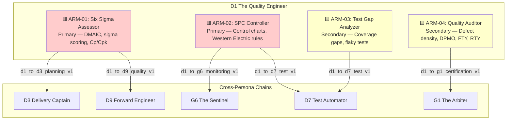
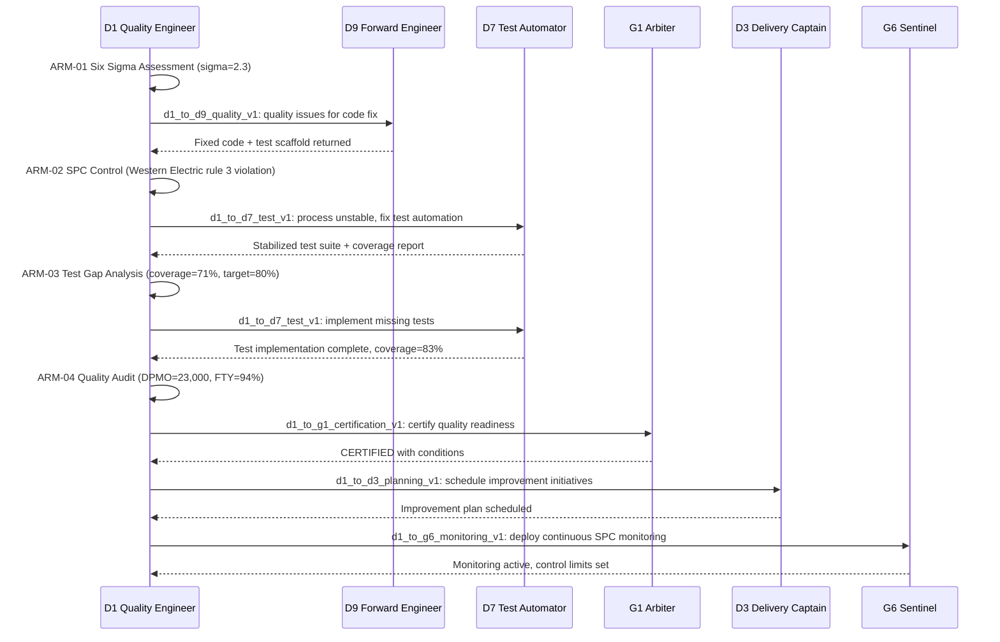

# AGENTIC_ARMS_OVERVIEW.md
## Persona D1 — The Quality Engineer | Agentic Arm Architecture

**Version:** 1.0.0
**Status:** Production-ready
**Date:** 2026-06-28
**Owner:** D1 The Quality Engineer
**Parent Strategy:** `C:\KimiWork Projects\GAI-OBSERVE-DESIGN\skills-hooks-plugins-strategy\STRATEGY.md`
**Persona Definition:** `C:\KimiWork Projects\CORPORATE V 0.5\PERSONA_D1_The_Quality_Engineer.md`
**Backend Standards:** `C:\KimiWork Projects\GAI-OBSERVE-DESIGN\architecture.md`

---

## 1. Executive Summary

The Quality Engineer (D1) is the **measurement and control backbone** of the GAI-OBSERVE advisory system. Its Agentic Arm Architecture defines how D1 applies Six Sigma methodology, statistical process control, and test strategy optimization across the ecosystem. Where other personas generate, secure, and deliver, D1 **measures, controls, and improves** — ensuring every artifact meets or exceeds quality standards through evidence-based analysis.

This document defines the complete arm topology, invocation semantics, cross-persona chaining, and operational contracts for all D1 agentic capabilities.

---

## 2. Agentic Arm Architecture



---

## 3. Primary Arms (2)

### ARM-01: Six Sigma Assessor
- **ID:** `six_sigma_assessor`
- **Purpose:** Complete DMAIC assessment — Define, Measure, Analyze, Improve, Control — with sigma level scoring, process capability indices (Cp/Cpk/Pp/Ppk), and control plans
- **Methodology:** DMAIC, DMADV, DFSS; statistical process capability; sigma level translation from DPMO
- **Trigger:** Scheduled (quarterly), on-demand (quality assessment request), event-driven (quality gate failure), chained (from D9 code generation quality gap)
- **Output:** DMAIC report JSON, sigma level scorecard, process capability study, control plan, improvement roadmap, visualization PNG
- **Critical Gate:** `R-ARM-DMAIC-2` — SPC violations match NumPy reference fixtures; `R-ARM-DMAIC-3` — Sigma scorecard and control plan emit as artifacts
- **Chains to:** D9 (code fixes for identified quality issues), D3 (implementation planning for improvement roadmap), G1 (quality certification)

### ARM-02: SPC Controller
- **ID:** `spc_controller`
- **Purpose:** Statistical Process Control — real-time control chart generation, Western Electric rule violation detection, anomaly detection, and process stability monitoring
- **Statistical Rules:** All 8 Western Electric rules (single point beyond 3σ, 2 of 3 beyond 2σ, 4 of 5 beyond 1σ, 8 consecutive on one side, 6 trending, 14 alternating, 15 in zone C, 8 beyond 1σ both sides)
- **Trigger:** Real-time (metric streaming), scheduled (every 15 min), on-demand (stability check), event-driven (threshold breach)
- **Output:** Control chart images, rule violation report, process stability verdict, anomaly detection JSON, alert dispatch
- **Critical Gate:** `R-ARM-DMAIC-1` — 8 Western Electric rules implemented with stateful project resumes; `R-ARM-DMAIC-4` — Phase transition without evidence is blocked
- **Chains to:** D7 (test automation when process instability detected), G6 (Sentinel monitoring integration), D5 (SRE alerting for production metrics)

---

## 4. Secondary Arms (2)

### ARM-03: Test Gap Analyzer
- **ID:** `test_gap_analyzer`
- **Purpose:** Coverage gap analysis, test strategy optimization, flaky test detection, and prioritized test plan generation
- **Metrics:** Line coverage, branch coverage, condition coverage, path coverage, mutation score, flaky test rate, test reliability index
- **Trigger:** On-demand (repo quality check), scheduled (nightly), event-driven (CI pipeline failure), chained (from D9 TDD Enforcer coverage gap)
- **Output:** Coverage gap map, prioritized test plan, flaky test report, test reliability scorecard, effort estimates
- **Critical Gate:** `R-ARM-REPRO-1` — Coverage gap map matches coverage.xml; `R-ARM-REPRO-2` — Flaky verdict backed by run statistics
- **Chains to:** D7 (test automation implementation), D9 (code generation for missing tests), D3 (scheduling test development)

### ARM-04: Quality Auditor
- **ID:** `quality_auditor`
- **Purpose:** Quality audit of code review practices, defect density analysis, DPMO/FTY/RTY computation, and overall quality scorecard generation
- **Metrics:** Defect density (defects/KLOC), DPMO (defects per million opportunities), FTY (first time yield), RTY (rolled throughput yield), OEE (overall equipment effectiveness), review velocity, review thoroughness
- **Trigger:** Scheduled (monthly), on-demand (pre-release audit), event-driven (defect spike), chained (from G1 certification request)
- **Output:** Quality scorecard, defect density report, code review audit, DPMO/FTY/RTY computation, improvement recommendations
- **Chains to:** G1 (quality certification), D9 (code review practice improvements), P2 (ledger event), D3 (delivery planning for quality initiatives)

---

## 5. Arm Composition: Cross-Persona Chaining



---

## 6. Arm Invocation Semantics

### 6.1 Invocation Pattern

Every D1 arm follows the same invocation contract:

```yaml
arm_invocation:
  trigger:
    type: enum [scheduled, on_demand, event_driven, chained]
    scheduled:
      cron: "0 */6 * * *"  # Every 6 hours for SPC; weekly for Six Sigma
      timezone: "UTC"
    on_demand:
      endpoint: "/v1/quality/{arm_id}/invoke"
      method: "POST"
    event_driven:
      source: ["quality_gate_failure", "coverage_drop", "defect_spike", "ci_failure", "flaky_test_detected"]
      queue: "d1-events"
    chained:
      from_persona: [D9, D7, G1, D3, G6, D5, P2]
      hook_contract: "d1_to_*_v1"
  input:
    target_id: "string (UUID or repo name)"
    target_type: "enum [repository, process, pipeline, module, system]"
    quality_data_uris: "array[string] (S3/MinIO paths to coverage, test, defect data)"
    standards: "object (target thresholds per metric)"
    historical_baselines: "object (optional previous assessments)"
  output:
    arm_id: "string"
    status: "enum [pass, warn, fail, error]"
    confidence: "float [0.0-1.0]"
    deliverable_uri: "string (artifact path)"
    ledger_hash: "string (P2 reference)"
    next_arms: ["arm_id or persona_id"]
  timeout:
    default_ms: 300000  # 5 minutes
    max_ms: 1800000    # 30 minutes (Six Sigma assessment)
  retry:
    policy: "exponential_backoff"
    max_attempts: 3
    backoff_base_ms: 1000
  fallback:
    on_timeout: "return_partial_results_with_warn_status"
    on_error: "log_to_ledger_and_alert_d5"
    on_unavailable: "queue_for_retry_and_notify_d3"
```

### 6.2 Arm Registry Table

| Arm ID | Name | Type | Trigger | Timeout | Retry | Fallback | Cross-Chain |
|--------|------|------|---------|---------|-------|----------|-------------|
| `ARM-01` | Six Sigma Assessor | Primary | Scheduled / On-demand / Event / Chained | 30 min | 3x exp backoff | Partial + alert | D9, D3, G1 |
| `ARM-02` | SPC Controller | Primary | Real-time / Scheduled / On-demand / Event | 5 min | 3x exp backoff | Cached baseline | D7, G6, D5 |
| `ARM-03` | Test Gap Analyzer | Secondary | On-demand / Scheduled / Event / Chained | 10 min | 3x exp backoff | Partial gaps | D7, D9, D3 |
| `ARM-04` | Quality Auditor | Secondary | Scheduled / On-demand / Event / Chained | 15 min | 3x exp backoff | Scorecard only | G1, D9, P2 |

---

## 7. Operational Standards

- **FastAPI:** All arm endpoints served via FastAPI routers with Pydantic v2 schemas
- **PostgreSQL:** All structured results stored in PostgreSQL 15 with JSONB columns
- **Redis:** Active session cache, job queue, and metric buffer
- **JWT:** RS256 token-based auth with role-based access (`d1-quality`, `d1-audit`, `d1-admin`)
- **Pydantic v2:** All input/output schemas use `BaseModel` with `EmailStr`, `UUID`, `Field` validators
- **Ports:** Dev 9000, Redis 6380, PostgreSQL 5433
- **Health:** `/health` and `/metrics` endpoints on every arm service
- **Testing:** Sync tests (TestClient) and async tests (AsyncClient) in separate pytest sessions
- **Compliance:** Reserved column name scan, JSONB pattern check, JWT library check (PyJWT only)
- **SPC Math:** All statistical computations validated against NumPy reference fixtures; deterministic core (R-GATE-2)

---

## 8. References

- `STRATEGY.md` — `C:\KimiWork Projects\GAI-OBSERVE-DESIGN\skills-hooks-plugins-strategy\STRATEGY.md`
- `PERSONA_D1_The_Quality_Engineer.md` — `C:\KimiWork Projects\CORPORATE V 0.5\PERSONA_D1_The_Quality_Engineer.md`
- `INITIATIVE_08_KNOWLEDGEENGINE_AUGMENTATION.md` — `C:\KimiWork Projects\GAI-OBSERVE-DESIGN\skills-hooks-plugins-strategy\INITIATIVE_08_KNOWLEDGEENGINE_AUGMENTATION.md`
- `ALPHA_CLAUDE_AUGMENTATION.md` — `C:\KimiWork Projects\GAI-OBSERVE-DESIGN\skills-hooks-plugins-strategy\ALPHA_CLAUDE_AUGMENTATION.md`
- `architecture.md` — `C:\KimiWork Projects\GAI-OBSERVE-DESIGN\architecture.md`

---

**Document Owner:** GAI-OBSERVE Advisory Architecture Team
**Next Review:** 2026-07-28
**Classification:** Internal — Architecture
